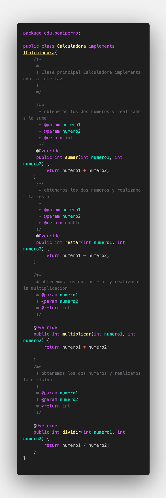
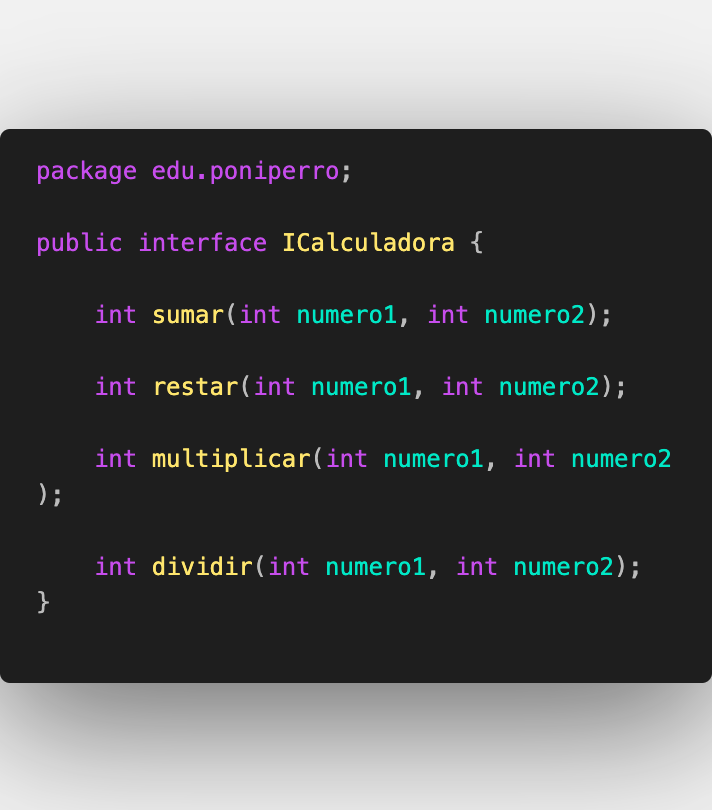
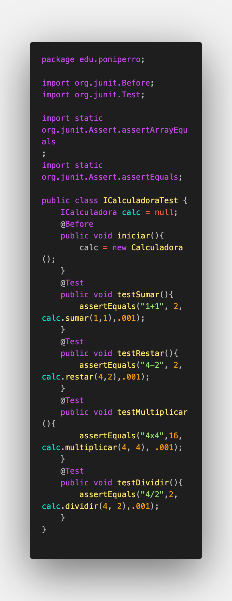

# **Práctica 5 - Entornos de Desarrollo**

### Instrucciones:

1. Crea un nuevo proyecto en github- po- nombr- Practica5.
2. Crea la interfaz ICalculadora con las operaciones sumar, restar,
multiplicar y dividir.
3. Crea la clase calculadora que utilice la interfaz anterior e implementa los
métodos.
4. Realiza el primer commit a github.
5. Luego, crea los test unitarios en JUnit (igual no es necesario descargarlo
porque puede venir incluido en vuestro IDE) de estos cuatro métodos.
6. Realiza el segundo commit.
7. Realiza diferentes pruebas para validar que los test funcionan y expón
los resultados obtenidos, % de tests pasados etc.

    >*Nota:* Si desesa ver los criterios y algunos recursos de utilidad para esta prácica lo que puede en este [pdf del enunciado.](./practica5_enunciado.pdf)

---

## **Procedimiento**

- ### Capturas del código:
  
     - Calculadora.java (Clase):
   

     - ICalculadora.java (Interfaz):
    
     
- ### Tests:
  - ICalculadoraTest.java:
  

- ### Balance de tests pasados:
- 
- ### Git log y versionado semántico:
- ### Git graph, working tree:
